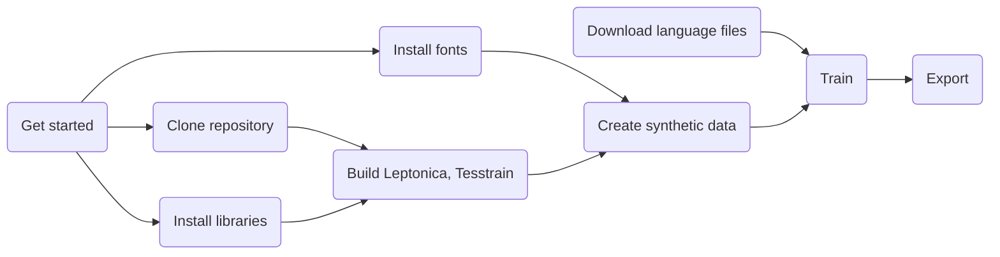

# Introduction

In this project we're using **[Tesseract](https://github.com/tesseract-ocr/tesseract) ,** an open source text recognition (OCR) engine developed by Google. 
**Tesseract** can be used directly via command line, or (for programmers) by using an API to extract printed text from images.
Default **OCR engine** can recognize text quite good in most cases. But there are some exceptions. 
For **foreign languages**, weird shaped, hard to distinguish fonts, handwritten symbols or if it needs to work flawlessly on only one specific font, we need to train the **Tesseract model** so that accuracy would be much better.

# Requirements

 


- Currently, training Tesseract-OCR only works on **Linux**. You can dual boot Ubuntu or install any virtual machine you like.  In this project we would be using [**WSL2**](https://learn.microsoft.com/en-us/windows/wsl/install), built-in Linux subsystem for Windows. But the procedure would be same for all.

 -  **Dedicated GPU** is optional. But training could take long time to achieve results you seek without powerful computer.
 ## Workflow:


## Cloning repository

Clone this repository to your home folder. It contains some necessary files needed.
 ```bash
cd ~
git clone https://github.com/Evilhaem/tesseract-tutorial.git
cd tesseract-tutorial
git clone https://github.com/tesseract-ocr/tesseract.git
git clone https://github.com/tesseract-ocr/tesstrain.git
```

## Installing required libraries

First of all, we install Tesseract with dev-tools
```bash
sudo apt-get update
sudo add-apt-repository ppa:alex-p/tesseract-ocr-devel
sudo apt-get install -y tesseract-ocr
sudo apt-get install libtesseract-dev
 ```
 You can check if it's successfully installed by 
 ```bash 
 tesseract --version
```
 
Now install other libraries required to train. 
 ```bash
sudo apt-get install libicu-dev libpango1.0-dev libcairo2-dev make bc automake libtool unzip
```

Leptonica is required as well, but you're going to build it.

 ```bash
cd ~/tesseract_tutorial/tesstrain
make leptonica tesseract
make tesseract-langdata
```

 ```bash
autoconf
./configure
make
make training
sudo make training-install
```

## Installing font

Download fonts you like to train and copy to fonts folder in Linux.
You may need root permission.
 ```bash
cp 'FONT.ttf' /usr/share/fonts
cp 'FONT.ttf' /usr/local/share/fonts
```
I'll use Mogul Decor font that has some weird shapes.
 ```bash
cp 'Mogul Decor.ttf' /usr/share/fonts
cp 'Mogul Decor.ttf' /usr/local/share/fonts
```


## Download other files
If you're training on language other than English (for example Mongolian), you need to download language specific files from [here](https://github.com/tesseract-ocr/langdata_lstm).
And copy unicharset and xheights files to `data/lang-data` folder
 ```bash
cd ~/tesseract_tutorial/tesstrain/data/langdata
cp /mnt/c/Users/USERNAME/Downloads/Latin.unicharset .
cp /mnt/c/Users/USERNAME/Downloads/Latin.xheights .
```

Mongolian:
 ```bash
cp /mnt/c/Users/USERNAME/Downloads/Cyrillic.unicharset .
cp /mnt/c/Users/USERNAME/Downloads/Cyrillic.xheights .
```

## Creating synthetic data

For this project I've written small python code that utilizes `text2image` tool and create image files.
Navigate to the cloned repository and edit `create_data.py` file.
You can change font name, language, output folder name and how many lines of text you going to create as your need. 
We're using only 100 lines of text for tutorial, so the training time is low. In reality you might need to train at least 10000 lines to effectively increase accuracy.
Now run the executable file.
 ```bash
python3 create_data.py
```
This will create text files and image files that corresponds to each other in `MODELNAME-ground-truth` folder.
> Remember that `MODELNAME` varies. In our case, it's `Output-ground-truth` 


## Training

Finally, now we can train our model.
You can change parameters according to your needs.
``` bash
TESSDATA_PREFIX=../tesseract/tessdata make training MODEL_NAME=Output START_MODEL=eng TESSDATA=../tesseract/tessdata MAX_ITERATIONS=100
```
``` bash
TESSDATA_PREFIX=../tesseract/tessdata make training MODEL_NAME=Output START_MODEL=mon TESSDATA=../tesseract/tessdata MAX_ITERATIONS=100
```
We can train our model multiple times since `tesstrain` saves checkpoints automatically.
Each cycle of train, we can see how much improvement we're getting.

## Save .traineddata file

You can get finished trained file from tesstrain/data folder.
``` bash
cd ~/tesseract_tutorial/tesstrain/data
explorer.exe Output.traineddata
```
Now we can use this trained data in Tesseract engine and get better accuracy.
